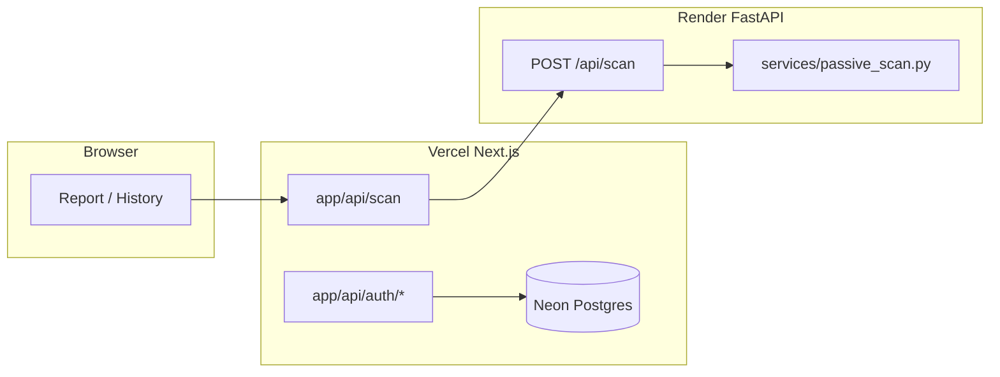
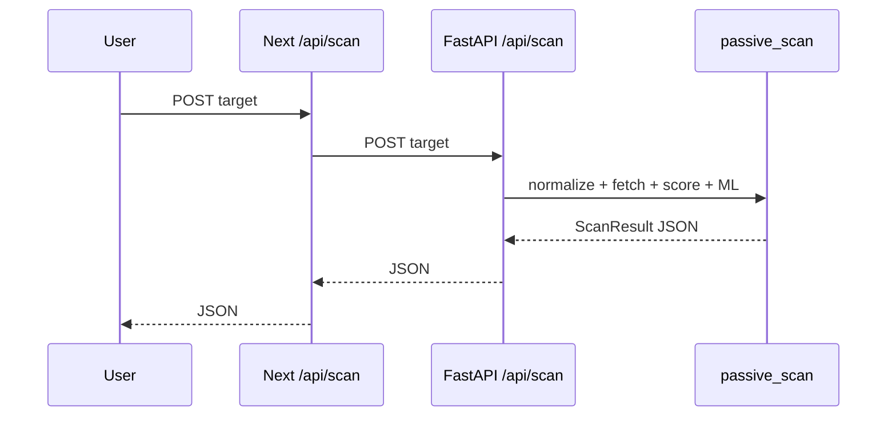

# Outliner — developer technical inventory

Thesis-ready overview of the **outliner** repository: structure, frontend/backend/ML, persistence, testing, deployment, and suggested documentation figures. Paths are relative to the repository root.

---

## 1. Top-level repository structure

| Path | Purpose |
|------|---------|
| **`app/`** | Next.js App Router: pages (`page.tsx`), layouts (`layout.tsx`), Route Handlers under `app/api/*` (auth, scan proxy, saved scans). |
| **`components/`** | React UI: `Navbar.tsx`, `DomainInput.tsx`, `Footer.tsx`, `report/*` (report composition), `history/*`. |
| **`lib/`** | Shared TypeScript: `db.ts`, `auth-server.ts`, `session-token.ts`, `password.ts`, `rules.ts`, `reportNarrative.ts`, `compareScans.ts`, `normalizeDomain.ts`, `rules.test.ts`. |
| **`middleware.ts`** | Edge middleware: protects `/history/*`, `/dashboard`; redirects logged-in users away from `/login` / `/register`. |
| **`backend/`** | FastAPI service: `main.py` (HTTP API), `services/` (scan, scoring, ML), `utils/` (normalize, SSRF), `schemas.py`, `tests/`, `scripts/`, `models/`, `data/`. |
| **`lab/`** | Local Docker/nginx test targets for lab scans (see `lab/README.md`). |
| **`data/`** | Legacy note in README (SQLite); app persistence is Postgres via Neon. |
| **`package.json`**, **`tailwind.config.ts`** | Frontend tooling and styling. |
| **`backend/requirements.txt`** | Python dependencies for the scanner. |

---

## 2. Frontend architecture

### Routes / pages (`app/*/page.tsx`)

- **`/`** — Landing (`app/page.tsx`).
- **`/report`** — Report UI (`app/report/page.tsx`): query params `target` (live scan) or `scanId` (saved JSON from DB).
- **`/login`**, **`/register`** — Auth pages.
- **`/dashboard`** — Signed-in workspace.
- **`/history`**, **`/history/compare`** — History and comparison.
- **`/about`**, **`/method`** — Informational pages.

### Important UI components (`components/`)

- **`Navbar.tsx`** — Client auth: `fetch('/api/auth/me')`, LOG OUT → `POST /api/auth/logout`.
- **`DomainInput.tsx`** — Target entry for scans.
- **`report/ReportHeader.tsx`**, **`ScorePanel.tsx`**, **`ScoreModeToggle.tsx`**, **`ScoreContext.tsx`** — Scores and context.
- **`report/SecurityProfile.tsx`** — Radar (five categories).
- **`report/IssueList.tsx`**, **`TopDrivers.tsx`**, **`BeginnerSummary.tsx`**, **`ExecutiveSummaryStrip.tsx`** — Issues and summaries.
- **`report/EvidenceSnapshot.tsx`**, **`FailedScanNotice.tsx`**, **`ViewToggle.tsx`**, **`ModelInsight.tsx`**, **`MlReliabilityPanel.tsx`**.

### Shared utilities (`lib/`)

- **`normalizeDomain.ts`** — Client-side target trimming for navigation (server validates in Python).
- **`rules.ts`** — `RULES`, `evaluateRules(features)`, `buildCategorySummaries(issues, features)` — frontend mirror for issues and category summaries (numeric score comes from backend).
- **`reportNarrative.ts`** — `deriveExecutiveSummary`, `deriveMlReliability` — user-facing narrative strings.
- **`compareScans.ts`** — `digestScanPayload`, `buildCompareVerdict`, `extractRuleScore`, `extractMlScore`.

### Authentication / session

- **`lib/session-token.ts`** — `signUserSession`, `verifyUserSession`, `sessionCookieOptions`; cookie name `outliner_session` (JWT via **jose**).
- **`app/api/auth/login/route.ts`**, **`register/route.ts`** — Set session cookie after credential check / insert.
- **`app/api/auth/logout/route.ts`** — Clear cookie.
- **`app/api/auth/me/route.ts`** — `getCurrentUser()` for navbar.
- **`lib/auth-server.ts`** — `getCurrentUser`, `getSessionUserId` via `next/headers` `cookies()`.
- **`lib/password.ts`** — bcrypt (`bcryptjs`).

### Saved scans / history / comparison

- **`app/api/scans/route.ts`** — GET list (parses `result_json`); POST save (`INSERT INTO saved_scans`).
- **`app/api/scans/[id]/route.ts`** — Load one saved scan by id.
- **`lib/db.ts`** — Postgres pool; `users` / `saved_scans` DDL.
- **`app/history/compare/page.tsx`** + **`lib/compareScans.ts`** — Comparison verdicts.

### Report page composition (`app/report/page.tsx`)

1. Resolves live (`target`) vs saved (`scanId`); loads JSON via `POST /api/scan` or saved-scan API.
2. On success: `evaluateRules` → `buildCategorySummaries`; `deriveExecutiveSummary`; optional `deriveMlReliability`.
3. Renders `FailedScanNotice` if `scan_status === 'failed'`; otherwise score panel, radar, issues, evidence.

### Textual summaries / explanations

- **Backend:** `backend/services/scoring_v2.py`, `scoring_v3.py`; `score_context.py` (`get_score_context`); `ml_inference.py` (`predict_rule_score`, `_reliability_from_distance`).
- **Frontend:** `lib/reportNarrative.ts`; `lib/rules.ts` per-rule description/recommendation; report components for Beginner/Technical copy.

---

## 3. Backend architecture (FastAPI)

### Main API entrypoints (`backend/main.py`)

| Endpoint | Handler | Role |
|----------|---------|------|
| `GET /health` | `health()` | Liveness. |
| `POST /api/fetch` | `api_fetch` | Normalize + SSRF + `perform_fetch`. |
| `POST /api/scan` | `api_scan` | Full passive scan → `ScanResult`. |

Invalid target / blocked host → **400**. Unreachable targets → **200** with `scan_status="failed"` (`backend/services/passive_scan.py`).

### Request flow for `POST /api/scan`

1. `perform_passive_scan(target)` (`backend/services/passive_scan.py`).
2. `normalize_target` (`backend/utils/normalize.py`) → `NormalizedTarget`.
3. `is_blocked_host` (`backend/utils/ssrf.py`); optional `OUTLINER_ALLOW_LOCALHOST` for lab.
4. HTTP fetch + TLS + feature extraction in `_scan_body`.
5. `compute_rule_score_v2` (`scoring_v2.py`) — primary `rule_score`, `rule_grade`, etc.
6. `compute_rule_score` (`scoring_v3.py`) — parallel v3 fields (`rule_score_v3`, …).
7. `get_score_context` (`score_context.py`) — percentile when dataset present.
8. `ml_predict_rule_score` (`ml_inference.py`) — optional; failures swallowed in `passive_scan`.

### Target normalization (`backend/utils/normalize.py`)

- `normalize_target(raw)` → `NormalizedTarget`: default `https://`, `urlparse`, hostname lowercasing, strip `www.`, validation via `_validate_hostname`.

### SSRF / request safety (`backend/utils/ssrf.py`)

- `is_blocked_host(hostname)`: blocks localhost, `.local`, loopback/private IPs, `0.0.0.0` unless `OUTLINER_ALLOW_LOCALHOST` is set.

### Passive scan pipeline

- **`backend/services/passive_scan.py`** — `perform_passive_scan`, `_classify_scan_error`, `_make_failed_result`, timeouts via `OUTLINER_*` env vars.
- **`backend/services/fetch.py`** — `perform_fetch` (redirects, headers).

### Feature extraction & evidence

- Built in `passive_scan.py` into `ScanFeatures` and `ScanEvidence` (`schemas.py`).

### Score computation

- **Primary display:** `compute_rule_score_v2` → top-level `rule_score` in `ScanResult`.
- **Parallel:** `compute_rule_score` (v3) → `rule_score_v3`, etc.
- **ML:** `predict_rule_score` in `ml_inference.py` using `ml_features.build_feature_row`, `feature_row_to_vector`.

### Failure handling

- `_make_failed_result` with `scan_error_type`, `scan_error_message`; full-scan `asyncio.wait_for` timeout.

### Next.js proxy (`app/api/scan/route.ts`)

- Forwards JSON `POST` to `OUTLINER_SCANNER_URL` + `/api/scan` so the browser does not call the Python host directly (CORS / config).

---

## 4. Data and ML pipeline

| Topic | Location |
|-------|----------|
| Lab targets | `lab/`, `OUTLINER_ALLOW_LOCALHOST`; scripts `test_lab.py`, `test_failed_scan_response.py`, `check_redirect_probe.py`. |
| Batch real sites | `backend/scripts/batch_scan.py` + `backend/data/targets.txt` → `scans.jsonl` / `scans.csv`, `failures.jsonl`. |
| Raw / processed data | `backend/data/` — see `backend/data/README.md`; canonical cleaned JSONL `data/processed/scans.v3_combined.cleaned.jsonl` (often not committed). |
| Cleaning / datasets | `clean_scans_jsonl.py`, `combine_scans.py`, `export_regression_dataset.py`, `export_ml_dataset.py`, `split_*.py`, `enrich_canonical_v2.py`, etc. |
| Feature engineering (ML) | `backend/services/ml_features.py` — `build_feature_row`, `feature_row_to_vector` (leakage-safe inputs per `data/README.md`). |
| Training | `backend/models/train_regression_baseline.py`, `backend/scripts/train_hist_gradient_boosting.py`. |
| Models evaluated | Linear / Random Forest / Gradient Boosting / HistGradientBoosting (see `data/ml/results/` after runs). |
| Evaluation | `evaluate_regression_models.py`, `validate_scoring_v2.py`, `compute_permutation_importance.py`. |
| Runtime model | `HistGradientBoostingRegressor` artifacts under `backend/data/ml/artifacts/` (`hist_gradient_boosting_depth5*.joblib`, `*_features.json`, optional reliability artifacts). See `ml_inference.py`. |
| Inference | `backend/services/ml_inference.py` — `predict_rule_score`. |
| Reliability | Backend: `_reliability_from_distance` (k-NN distance). Frontend: `deriveMlReliability` in `reportNarrative.ts`. |
| Methodology notes | `backend/docs/ML_PIPELINE_AUDIT.md`, `backend/docs/MOZILLA_COMPARISON.md`, `backend/docs/SCORING_V2_TRANSITION.md`. |

---

## 5. Rule and explanation logic

| Layer | Location | Role |
|-------|----------|------|
| Backend numeric scoring | `scoring_v2.py`, `scoring_v3.py` | Deterministic scores, grades, `rule_reasons`. |
| Frontend issues | `lib/rules.ts` — `RULES`, `evaluateRules`, `buildCategorySummaries` | Issue list and category strength for UI. |
| Narrative | `lib/reportNarrative.ts` | Executive summary and ML reliability copy. |

---

## 6. Persistence layer

| Item | Detail |
|------|--------|
| Database | PostgreSQL (e.g. Neon) via `DATABASE_URL`. |
| Schema | `lib/db.ts` — `users`, `saved_scans`; index `idx_saved_scans_user_created`. |
| Stored | Users: email, password hash. Saved scans: `result_json` (full scan JSON), `user_id`, `created_at`. |
| Sessions | JWT in httpOnly cookie — not DB-backed server sessions. |

---

## 7. Testing and validation

| Kind | Location |
|------|----------|
| Frontend | `npm test` → `lib/rules.test.ts`. |
| Backend | `backend/tests/test_api.py`, `test_scoring_v2.py`, `conftest.py`. |
| Lab | `lab/` + `OUTLINER_ALLOW_LOCALHOST`. |
| External | `backend/scripts/compare_with_mozilla.py` — `backend/docs/MOZILLA_COMPARISON.md`. |

---

## 8. Deployment / runtime

| Topic | Detail |
|-------|--------|
| Local | Next `npm run dev`; FastAPI `uvicorn main:app --port 8000`; `OUTLINER_SCANNER_URL` for proxy. |
| Typical cloud | Vercel (Next), Render (FastAPI), Neon (Postgres). |
| Next env | `DATABASE_URL`, `OUTLINER_AUTH_SECRET`, `OUTLINER_SCANNER_URL` (see `.env.example`). |
| Scanner env | `OUTLINER_ALLOW_LOCALHOST`, timeout overrides in `passive_scan.py`. |

---

## 9. Suggested thesis diagrams

1. **Architecture** — Browser → Vercel (Next) → Render (FastAPI) → HTTPS targets; Neon for auth/saves.
2. **Sequence** — User target → `POST /api/scan` (Next) → FastAPI `/api/scan` → normalize → SSRF → fetch → features → scoring → ML → JSON → report.
3. **ML pipeline** — JSONL → clean/export → train/val/test → artifacts → `predict_rule_score` at scan time.
4. **Model comparison** — Table/chart from `regression_results.json` or evaluation CSVs.
5. **Module dependency** — `main.py` → `passive_scan` → `fetch`, `scoring_v2`, `scoring_v3`, `ml_inference`, `score_context`.

### Mermaid examples (paste into thesis or export)

**Architecture**

**Sequence**

---

## A. Recommended thesis chapter structure — Developer documentation

1. Purpose and scope (web app vs scanner vs ML tooling).
2. Repository map (§1).
3. Runtime architecture (Vercel + Render + Neon; env vars; sequence).
4. Frontend — routes, components, auth, saved scans, report composition (§2).
5. Backend scanner — `main.py`, `/api/scan` pipeline, SSRF, timeouts, failures (§3).
6. Scoring and rules — v2 vs v3; alignment with frontend `rules.ts` (§5).
7. ML pipeline — data, leakage-safe features, training, artifacts, inference, reliability (§4).
8. External validation — Mozilla/MDN comparison (limitations).
9. Persistence — schema and stored fields (§6).
10. Testing and operations (§7–8).
11. Appendix — file index, env reference, diagram sources.

---

## B. Figures / tables worth adding

| # | Type | Content |
|---|------|---------|
| 1 | Figure | System architecture (browser, Vercel, Render, Neon). |
| 2 | Figure | Scan request sequence (end-to-end). |
| 3 | Figure | Report page component layout (wireframe). |
| 4 | Figure | ML pipeline (JSONL → train → artifact → inference). |
| 5 | Table | API endpoints (`/health`, `/api/fetch`, `/api/scan`, Next `/api/*`). |
| 6 | Table | `ScanFeatures` field groups. |
| 7 | Table | v2 vs v3 scoring (ranges, roles). |
| 8 | Table | Regression models + metrics (from pipeline outputs). |
| 9 | Figure | Actual vs predicted / residuals (from `backend/data/ml/results/plots/` if generated). |
| 10 | Table | Environment variables (Next + scanner). |

---

## C. End-to-end pipeline (user input → report)

1. User enters a target; client navigates to `/report?target=...`.
2. `app/report/page.tsx` calls `POST /api/scan` on the Next origin with `{ target }`.
3. `app/api/scan/route.ts` proxies to `OUTLINER_SCANNER_URL/api/scan` (FastAPI).
4. `perform_passive_scan` normalizes the URL, runs SSRF check, fetches the site, builds `ScanFeatures` + `ScanEvidence`.
5. Rule scores: `compute_rule_score_v2` (primary), `compute_rule_score` (v3); `get_score_context` adds percentile when data exists; ML adds `predicted_rule_score` when artifacts load.
6. JSON returns to the browser; the report runs `evaluateRules` / `buildCategorySummaries`, `deriveExecutiveSummary`, and renders score panel, radar, issues, evidence.
7. If signed in, the client may `POST /api/scans` with the scan JSON to persist `saved_scans.result_json` for history/compare.

---

*Generated for thesis documentation. Update this file when the codebase changes materially.*
